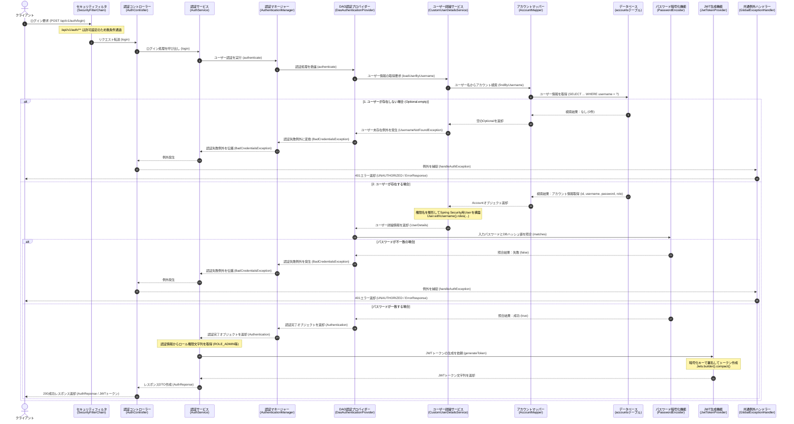
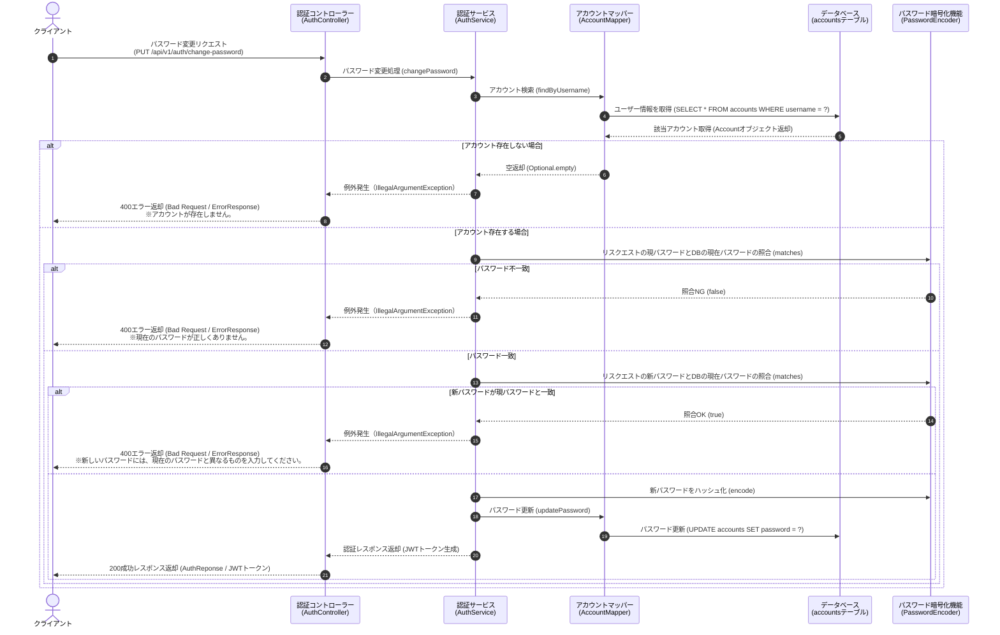
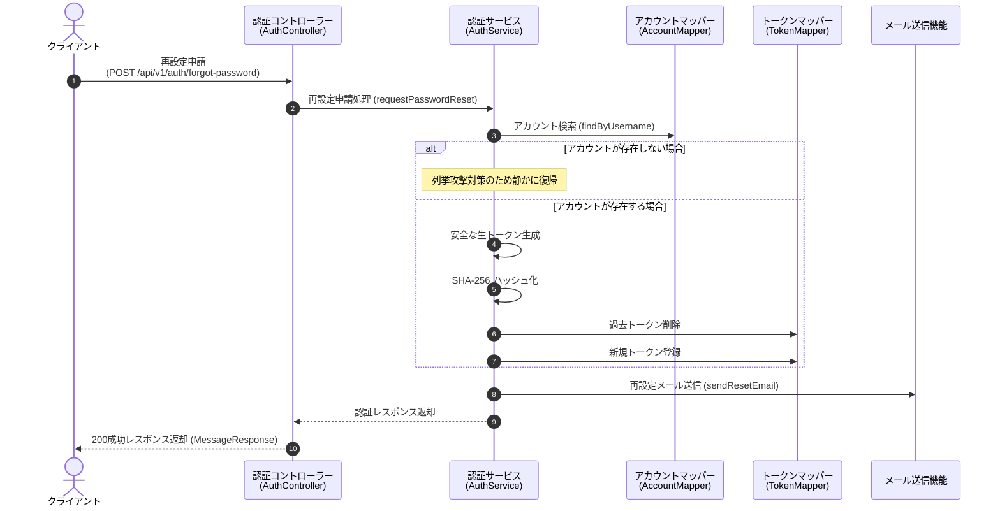
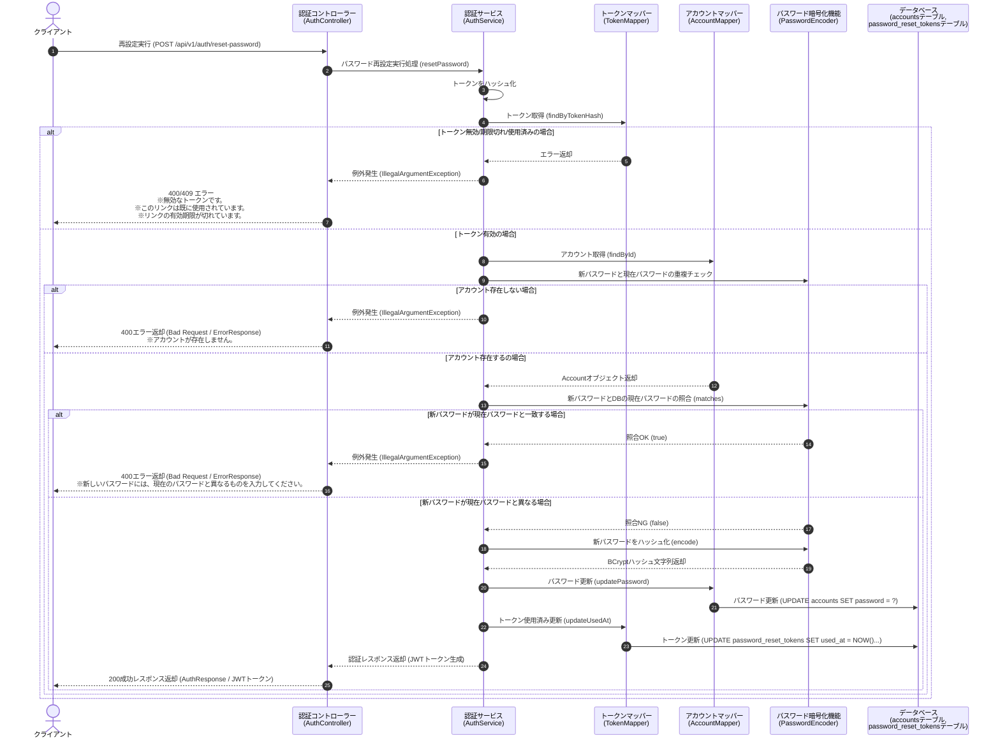
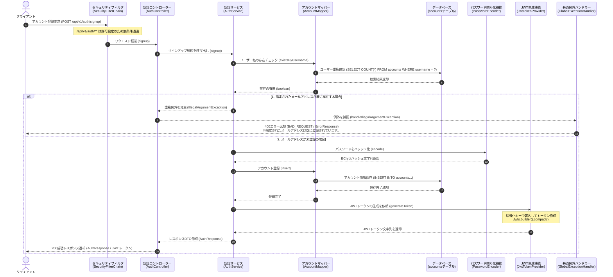

# 認証・認可API仕様書

---

## 1. 概要

### 1.1 目的

本APIは認証・認可機能（アカウント登録、ログイン認証、パスワード変更、パスワード再設定）を提供する REST API の仕様を定義します。

### 1.2 システム構成

- **技術スタック**:
  - Spring Security, MyBatis, JWT (`jjwt`), PostgreSQL, BCrypt
- **方式**:
  - JWT（JSON Web Token）によるステートレス認証
- **パスワードハッシュ化**:
  - BCrypt（アルゴリズム）

---

## 2. 共通仕様

### 2.1 JWT トークン仕様

- **ヘッダー/形式**:
  - Bearer トークン (`Authorization: Bearer <token>`)
- **有効期限**:
  - 24時間 (`86,400,000` ms)
- **Claims（トークンに含まれる情報）**:
  - `sub` (username)
  - `roles` (権限情報)
  - `iat` / `exp` (発行日時・有効期限)

### 2.2 共通エラーレスポンス構造 (`ErrorResponse`)

エラー発生時は、HTTP ステータスコードに応じた統一フォーマットの JSON を返却します。

| 項目名 | 型 | 説明 | 例 |
| --- | --- | --- | --- |
| `timestamp` | String (ISO-8601) | エラー発生時刻 (日本時間) | `"2026-08-13T21:00:00.000+09:00"` |
| `status` | Integer | HTTP ステータスコード | `401` |
| `error` | String | エラー種別識別子 | `"UNAUTHORIZED"` |
| `message` | String | ユーザー向けエラー詳細メッセージ | `"ユーザー名またはパスワードが正しくありません。"` |

### 3.2 エラー種別マッピング

| エラー種別 | 説明 |
| --- | --- |
| `400 Bad Request` (`BAD_REQUEST`) | リクエストパラメータ不正、バリデーションエラー、アカウント重複、無効/期限切れトークンなど |
| `401 Unauthorized` (`UNAUTHORIZED`) | 認証失敗（ID/パスワード不一致） |
| `500 Internal Server Error` (`INTERNAL_SERVER_ERROR`) | サーバー内部エラー、メール送信失敗など |

---

## 3. エンドポイント詳細仕様

### 3.1 新規アカウント登録 (Signup)

新規ユーザーのアカウント登録を行い、登録完了後に自動ログイン用 JWT トークンを返却します。

- **URL**:
  - `/api/v1/auth/signup`
- **Method**:
  - `POST`
- **認証**:
  - 不要

#### リクエストボディ (`SignupRequest`)

```json
{
  "name": "山田 太郎",
  "username": "user@example.com",
  "password": "password123"
}
```

| 項目名 | 型 | 必須 | 説明 |
| --- | --- | --- | --- |
| `name` | String | ○ | ユーザー表示名 |
| `username` | String | ○ | ユーザー名（メールアドレス形式） |
| `password` | String | ○ | パスワード（平文） |

#### レスポンス (`200 OK` / `AuthResponse`)

```json
{
  "token": "eyJhbGciOiJIUzI1NiJ9...",
  "username": "user@example.com",
  "name": "山田 太郎"
}
```

#### エラーレスポンス例 (`400 Bad Request`)

- 既に該当ユーザー名が存在する場合：

```json
{
  "timestamp": "2026-08-13T21:00:00.000+09:00",
  "status": 400,
  "error": "BAD_REQUEST",
  "message": "指定されたメールアドレスは既に登録されています。"
}
```

---

### 3.2 ログイン (Login)

ユーザー認証（ユーザー名・パスワード）を行い、認証に成功した場合に JWT トークンを発行します。

- **URL**:
  - `/api/v1/auth/login`
- **Method**:
  - `POST`
- **認証**:
  - 不要

#### リクエストボディ (`AuthRequest`)

```json
{
  "username": "user@example.com",
  "password": "password123"
}
```

| 項目名 | 型 | 必須 | 説明 |
| --- | --- | --- | --- |
| `username` | String | ○ | ユーザー名（メールアドレス） |
| `password` | String | ○ | パスワード（平文） |

#### レスポンス (`200 OK` / `AuthResponse`)

```json
{
  "token": "eyJhbGciOiJIUzI1NiJ9...",
  "username": "user@example.com",
  "name": "山田 太郎"
}
```

#### エラーレスポンス例 (`401 Unauthorized`)

- ユーザー名またはパスワードに誤りがある場合：

```json
{
  "timestamp": "2026-08-13T21:00:00.000+09:00",
  "status": 401,
  "error": "UNAUTHORIZED",
  "message": "ユーザー名またはパスワードが正しくありません。"
}
```

---

### 3.3 パスワード変更 (Change Password)

ログイン中のユーザーが自身のパスワードを変更します。現在パスワードによる照合と、新旧パスワードの重複チェックを実施します。変更完了後、更新後の自動ログイン用 JWT トークンを返却します。

- **URL**:
  - `/api/v1/auth/change-password`
- **Method**:
  - `POST`
- **認証**:
  - 不要（現在パスワードによる照合を実施）

#### リクエストボディ (`ChangePasswordRequest`)

```json
{
  "username": "user@example.com",
  "currentPassword": "oldPassword123",
  "newPassword": "newPassword456"
}
```

| 項目名 | 型 | 必須 | 説明 |
| --- | --- | --- | --- |
| `username` | String | ○ | ユーザー名（メールアドレス） |
| `currentPassword` | String | ○ | 現在のパスワード（平文） |
| `newPassword` | String | ○ | 新しいパスワード（平文） |

#### レスポンス (`200 OK` / `AuthResponse`)

```json
{
  "token": "eyJhbGciOiJIUzI1NiJ9...",
  "username": "user@example.com",
  "name": "山田 太郎"
}
```

#### エラーレスポンス例 (`400 Bad Request`)

- 現在のパスワードが正しくない場合：

```json
{
  "timestamp": "2026-08-13T21:00:00.000+09:00",
  "status": 400,
  "error": "BAD_REQUEST",
  "message": "現在のパスワードが正しくありません。"
}
```

- 新しいパスワードが現在のパスワードと同じ場合：

```json
{
  "timestamp": "2026-08-13T21:00:00.000+09:00",
  "status": 400,
  "error": "BAD_REQUEST",
  "message": "新しいパスワードには、現在のパスワードと異なるものを入力してください。"
}
```

- アカウントが存在しない場合：

```json
{
  "timestamp": "2026-08-13T21:00:00.000+09:00",
  "status": 400,
  "error": "BAD_REQUEST",
  "message": "アカウントが存在しません。"
}
```

---

### 3.4 パスワード再設定申請 (Forgot Password)

パスワードを忘れたユーザーからの再設定申請を受け付け、再設定用トークンを発行して案内メールを送信します。
※ユーザー存在チェックによる列挙攻撃を防止するため、指定されたユーザーが存在しない場合でも同一の成功レスポンスを返却します。

- **URL**:
  - `/api/v1/auth/forgot-password`
- **Method**:
  - `POST`
- **認証**:
  - 不要

#### リクエストボディ (`ForgotPasswordRequest`)

```json
{
  "username": "user@example.com"
}
```

| 項目名 | 型 | 必須 | 説明 |
| --- | --- | --- | --- |
| `username` | String | ○ | ユーザー名（メールアドレス） |

#### レスポンス (`200 OK` / `MessageResponse`)

```json
{
  "message": "パスワード再設定用のメールを送信しました。"
}
```

#### メール送信仕様

- **有効期限**:
  - トークン発行から30分
- **送信先**:
  - リクエストされたメールアドレス
- **再設定用URL形式**:
  - `{cors.allowed-origins}/reset-password?token={rawToken}`
- **トークン保存仕様**:
  - 過去の未消費トークンは物理削除の上、生トークンの SHA-256 ハッシュ値を DB に保存

---

### 3.5 パスワード再設定実行 (Reset Password)

メール通知された生トークンを検証し、パスワードの再設定を行います。完了後、使用済みフラグ（`used_at`）を更新し、新しい JWT トークンを返却します。

- **URL**:
  - `/api/v1/auth/reset-password`
- **Method**:
  - `POST`
- **認証**:
  - 不要

#### リクエストボディ (`ResetPasswordRequest`)

```json
{
  "token": "raw_token_string_from_email",
  "newPassword": "newPassword456"
}
```

| 項目名 | 型 | 必須 | 説明 |
| --- | --- | --- | --- |
| `token` | String | ○ | メール通知された生トークン文字列 |
| `newPassword` | String | ○ | 新しいパスワード（平文） |

#### レスポンス (`200 OK` / `AuthResponse`)

```json
{
  "token": "eyJhbGciOiJIUzI1NiJ9...",
  "username": "user@example.com",
  "name": "山田 太郎"
}
```

#### エラーレスポンス例 (`400 Bad Request` / `409 Conflict`)

- トークンが無効な場合 (`400 Bad Request`)：

```json
{
  "timestamp": "2026-08-13T21:00:00.000+09:00",
  "status": 400,
  "error": "BAD_REQUEST",
  "message": "無効なトークンです。"
}
```

- トークンが既に使用済みの場合 (`409 Conflict`)：

```json
{
  "timestamp": "2026-08-13T21:00:00.000+09:00",
  "status": 409,
  "error": "CONFLICT",
  "message": "このリンクは既に使用されています。"
}
```

- トークンの有効期限が切れている場合 (`400 Bad Request`)：

```json
{
  "timestamp": "2026-08-13T21:00:00.000+09:00",
  "status": 400,
  "error": "BAD_REQUEST",
  "message": "リンクの有効期限が切れています。"
}
```

- 新しいパスワードが現在のパスワードと同じ場合 (`400 Bad Request`)：

```json
{
  "timestamp": "2026-08-13T21:00:00.000+09:00",
  "status": 400,
  "error": "BAD_REQUEST",
  "message": "新しいパスワードには、現在のパスワードと異なるものを入力してください。"
}
```

---

## 4. データベーステーブル定義（参考）

### `accounts` テーブル

| カラム名 | 型 | 制約 | 説明 |
| --- | --- | --- | --- |
| `id` | BIGINT | PRIMARY KEY, AUTO_INCREMENT | アカウントID |
| `username` | VARCHAR | UNIQUE, NOT NULL | ユーザー名（メールアドレス） |
| `password` | VARCHAR | NOT NULL | BCrypt暗号化済みパスワード |
| `name` | VARCHAR | NOT NULL | ユーザー表示名 |
| `role` | VARCHAR | NOT NULL | 権限ロール (`ROLE_USER`等) |

### `password_reset_tokens` テーブル

| カラム名 | 型 | 制約 | 説明 |
| --- | --- | --- | --- |
| `id` | BIGINT | PRIMARY KEY, AUTO_INCREMENT | トークンID |
| `account_id` | BIGINT | FOREIGN KEY | 対象アカウントID |
| `token_hash` | VARCHAR | NOT NULL | SHA-256 ハッシュ化済みトークン |
| `expires_at` | TIMESTAMP | NOT NULL | 有効期限（発行から30分） |
| `used_at` | TIMESTAMP | NULL | 消費日時 |
| `created_at` | TIMESTAMP | NOT NULL | 発行日時 (デフォルト `NOW()`) |

---

## 5. 処理フロー（シーケンス図）

### 5.1 ログイン認証・JWTトークン発行処理シーケンス



### 5.2 パスワード変更シーケンス



### 5.3 パスワード再設定申請処理シーケンス



### 5.4 パスワード再設定実行処理シーケンス



### 5.5 新規アカウント登録処理シーケンス


