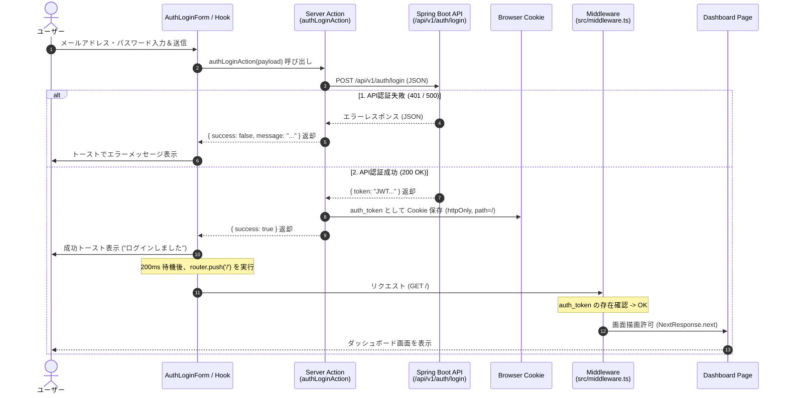
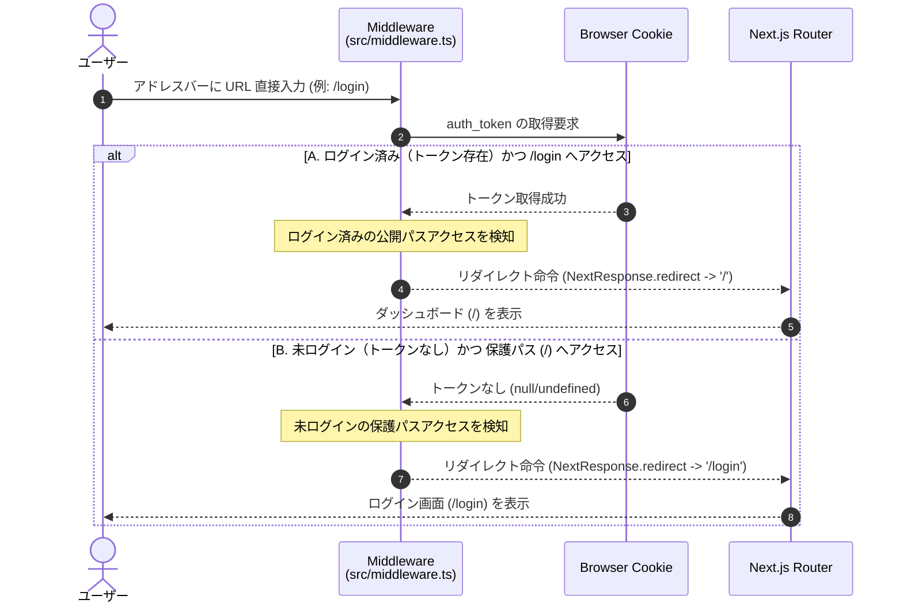

# Next.js 認証・認可＆ダッシュボード連携仕様書

---

## 1. 概要

### 1.1 目的

本仕様書は、Next.js（App Router）における認証・認可処理、JWT Cookieを用いたセッション管理、および保護された領域（ダッシュボード等）へのルーティング制御・UI連携の仕様を定義します。

### 1.2 システム構成（フロントエンド側）

- **フレームワーク**:
  - Next.js (App Router, React 19)
- **UI ライブラリ**:
  - Tailwind CSS, shadcn/ui, Lucide Icons, Sonner (Toast)
- **フォーム管理**:
  - `react-hook-form`, `zod`
- **状態管理/通信**:
  - Server Actions, Custom Hooks (`useAuthLoginForm`)
- **認証方式**:
  - Cookie ベースのステートレス JWT 認証

---

## 2. 認証・認可アーキテクチャ

### 2.1 セッション管理（Cookie）

- **トークンキー**:
  - `auth_token`
- **保存形式**:
  - HTTP Cookie (`httpOnly: true`, `sameSite: 'lax'`, `path: '/'`)
- **ライフサイクル**:
  - ログイン成功時：Server Action 経由で Cookie に JWT を保存
  - ログアウト時：Cookie を削除（※Sprint 4実装予定）

### 2.2 アクセス制御マトリクス

| パス | 種別 | 未ログイン時 | ログイン済み時 |
| --- | --- | --- | --- |
| `/login` | 公開パス (`PUBLIC_PATHS`) | アクセス可 | **`/`（ホーム）へ自動リダイレクト** |
| `/signup` | 公開パス (`PUBLIC_PATHS`) | アクセス可 | **`/`（ホーム）へ自動リダイレクト** |
| `/` (ダッシュボード) | 保護パス | **`/login` へ自動リダイレクト** | アクセス可 |
| `/api/**` | APIルート | ミドルウェア対象外 | ミドルウェア対象外 |

---

## 3. コンポーネントおよび処理設計

### 3.1 ディレクトリ構成・配置ルール

```text
src/
├── actions/
│   └── auth.ts             # Server Actions (authLoginAction)
├── app/
│   ├── (auth)/
│   │   └── login/         # ログインページ
│   └── (dashboard)/
│        └── page.tsx/      # ダッシュボード (保護ページ)
├── components/
│   ├── auth/
│   │   └── auth-login-form.tsx # ログインフォームUI
│   └── ui/
│       └── controlled-input.tsx # 共通制御入力 (パスワード表示切替機能内蔵)
├── hooks/
│   └── use-auth-login-form.ts  # ログインフォーム状態管理フック
├── constants/
│   └── auth.ts             # Cookieキー、パス定義定数
└── middleware.ts           # 認証・認可ミドルウェア (※配置場所に注意)

```

### 3.2 主要コンポーネントの役割

#### 3.2.1. **`ControlledInput` (`src/components/ui/controlled-input.tsx`)**

- `react-hook-form` と UI ライブラリを接続する汎用コンポーネント。
- `type="password"` が指定された場合、右端に表示/非表示切替トグル（`Eye` / `EyeOff`）を自動挿入する。

#### 3.2.2.  **`useAuthLoginForm` (`src/hooks/use-auth-login-form.ts`)**

- フォームのバリデーション、送信状態管理、Server Action の呼び出しを担当。
- 成功時には Sonner トーストを出力し、 `router.push('/')` でダッシュボード画面遷移を行う。

#### 3.2.3.  **`middleware.ts` (`src/middleware.ts`)**

- リクエスト毎に `auth_token` Cookie の有無を検証し、保護パスおよび公開パスへのアクセスを制御する。

---

## 4. 処理フロー（シーケンス図）

### 4.1 ログイン実行～ダッシュボード遷移フロー



### 4.2 直打ち（アドレスバー直接指定）アクセス時のミドルウェア制御フロー



---

## 5. 開発時の留意事項・ハマりどころ（Pitfalls & Best Practices）

ドキュメントとして将来の保守・改修時に特に注意すべきポイントを以下に記録します。

### ① `middleware.ts` の配置場所（最重要）

- **罠**: `src` ディレクトリ構造を採用しているプロジェクトにおいて、`middleware.ts` をプロジェクトルート直下に配置すると **Next.js に完全に無視され、ミドルウェアが一切起動しない**。
- **対策**: 必ず **`src/middleware.ts`** に配置すること。

### ② ミドルウェアの実行環境とログ出力

- **罠**: ミドルウェアはブラウザ（クライアント）ではなく Node.js サーバー環境で実行されるため、`console.log` を仕込んでもブラウザのデベロッパーツール（F12）には表示されない。
- **対策**: 動作確認時のログは **`npm run dev` を実行している Terminal（サーバーログ）** を確認すること。

### ③ Server Actions における `redirect()` の取り扱い

- **罠**: Server Action 内で Next.js の `redirect()` 関数を呼び出すと内部的に特殊な例外を発生させるため、呼び出し側の `try-catch` やカスタムフックで正常に結果を処理できず、トースト表示がキャンセルされる。
- **対策**: Server Action 側では `redirect()` は使わず、処理結果オブジェクト（`{ success: boolean, message?: string }`）を返却するのみ留める。リダイレクト制御は呼び出し側のクライアント（Custom Hook 内の `router.push` や `router.replace`）で実行する。

### ④ トースト表示と画面遷移のタイミング制御

- **罠**: ログイン成功時にトーストを表示して即座に `router.push()` を実行すると、コンポーネントがアンマウントされてトーストが画面に映る前に消えてしまう。
- **対策**: `setTimeout`（100〜300ms 程度）のディレイを挟んでから `router.push` を呼び出すことで、ユーザーに成功トーストを確実に視認させる。

### ⑤ CORS と Credentials（Spring Boot 連携）

- **罠**: Cookie を利用した認証通信を行う場合、Spring Boot 側の SecurityConfig で `allowedOrigins("*")` を設定しているとブラウザが Security エラーで通信を遮断する。
- **対策**: `allowCredentials(true)` を有効化し、`allowedOrigins` には `http://localhost:3000` などの具体的な送信元オリジンを明示的に指定すること。

---
