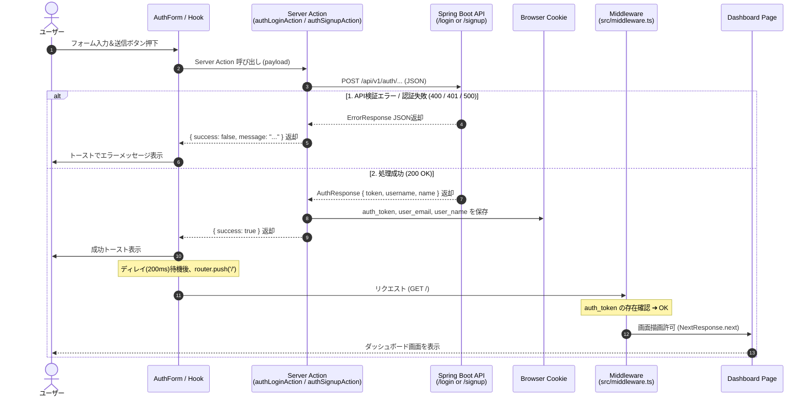
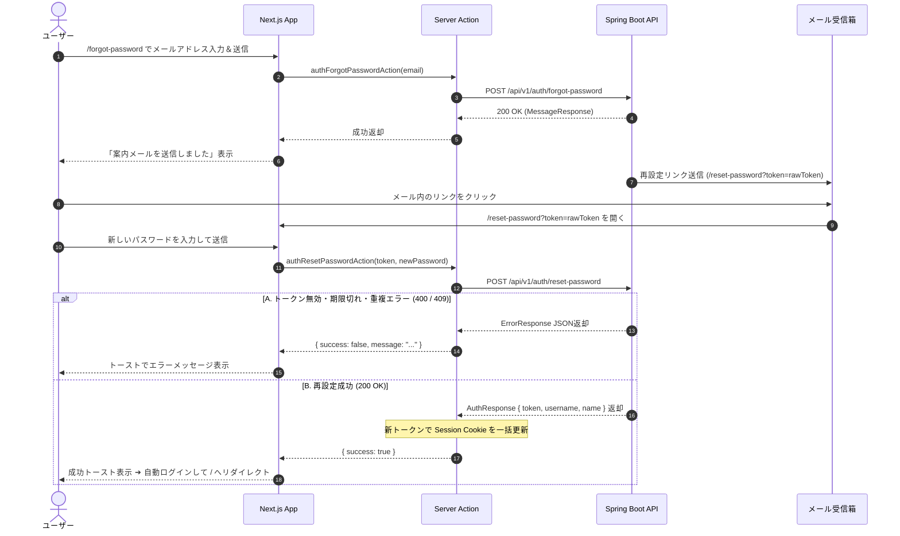
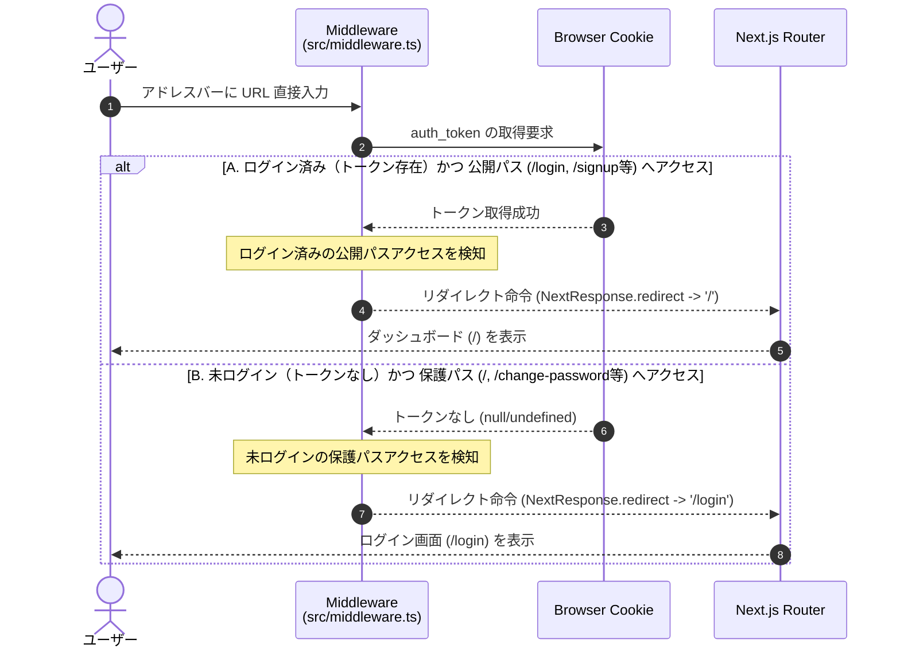
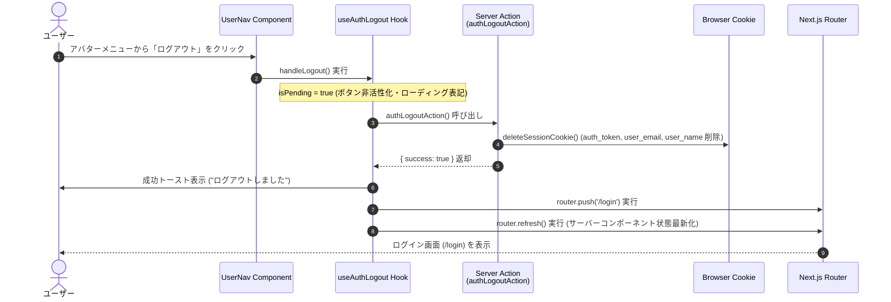

# Next.js 認証・認可＆ダッシュボード連携仕様書

---

## 1. 概要

### 1.1 目的

本仕様書は、Next.js（App Router）における認証・認可処理、JWT およびユーザー情報 Cookie を用いたセッション管理、保護領域（ダッシュボード・各種設定等）へのルーティング制御、各認証画面（ログイン、新規登録、パスワード変更、パスワード再設定）と Spring Boot REST API との連携仕様を定義します。

### 1.2 システム構成（フロントエンド側）

- **フレームワーク**:
  - Next.js (App Router, React 19)
- **UI ライブラリ**:
  - Tailwind CSS, shadcn/ui, Lucide Icons, Sonner (Toast)
- **フォーム管理**:
  - `react-hook-form`, `zod`
- **状態管理/通信**:
  - Server Actions, Custom Hooks (`useAuthLoginForm`, `useAuthSignupForm`, `useChangePasswordForm`, `useForgotPasswordForm`, `useResetPasswordForm`, `useAuthLogout`, `useCurrentUser`)
- **認証方式**:
  - Cookie ベースのステートレス JWT 認証 ＋ 表示用 Cookie 連携

---

## 2. 認証・認可アーキテクチャ

### 2.1 セッション管理（Cookie）

認証トークン（JWT）に加えて、クライアント側でユーザー情報を表示するための Cookie を一括管理します。

| Cookie キー | 設定値 | `httpOnly` | `sameSite` | 用途 |
| --- | --- | --- | --- | --- |
| `auth_token` | JWT トークン | `true` | `lax` | API 認証用トークン（JS 閲覧不可） |
| `user_email` | ユーザーID (メールアドレス) | `false` | `lax` | UI 表示用（ヘッダーアバター等） |
| `user_name` | ユーザー表示名 | `false` | `lax` | UI 表示用（ヘッダーアバター等） |

- **共通保存処理 (`saveSessionCookie`)**:
  - Server Action 内で `CookieItem[]` 配列を受け取り、ループ処理にて一括で Cookie をセットします。

- **ライフサイクル**:
  - **ログイン成功時**:
    - Spring Boot 側の `AuthResponse` から受け取った `トークン(token)`, `ユーザーID(username)`, `ユーザー表示名(name)` を各 Cookie に保存。

  - **ログアウト時**:
    - Server Action (`authLogoutAction`) 経由で全セッション Cookie (`auth_token`, `user_email`, `user_name`) を一括削除。

### 2.2 アクセス制御マトリクス

| パス | 種別 | 未ログイン時 | ログイン済み時 |
| --- | --- | --- | --- |
| `/login` | 公開パス (`PUBLIC_PATHS`) | アクセス可 | **`/`（ホーム）へ自動リダイレクト** |
| `/signup` | 公開パス (`PUBLIC_PATHS`) | アクセス可 | **`/`（ホーム）へ自動リダイレクト** |
| `/forgot-password` | 公開パス (`PUBLIC_PATHS`) | アクセス可 | **`/`（ホーム）へ自動リダイレクト** |
| `/reset-password` | 公開パス (`PUBLIC_PATHS`) | アクセス可 | **`/`（ホーム）へ自動リダイレクト** |
| `/` (ダッシュボード) | 保護パス | **`/login` へ自動リダイレクト** | アクセス可 |
| `/change-password` | 保護パス | **`/login` へ自動リダイレクト** | アクセス可 |
| `/api/**` | APIルート | ミドルウェア対象外 | ミドルウェア対象外 |

---

## 3. コンポーネントおよび処理設計

### 3.1 ディレクトリ構成・配置ルール

```text
src/
├── actions/
│   └── auth.ts                       # Server Actions (Login, Signup, ChangePassword, ForgotPassword, ResetPassword, Logout)
├── app/
│   ├── (auth)/
│   │   ├── login/                   # ログインページ
│   │   ├── signup/                  # 新規アカウント登録ページ
│   │   ├── forgot-password/         # パスワード再設定申請ページ
│   │   └── reset-password/          # パスワード再設定実行ページ (?token=xxx)
│   └── (dashboard)/
│       ├── layout.tsx                # ダッシュボード共通レイアウト (Header 配置)
│       ├── page.tsx                  # ダッシュボード (保護ページ)
│       └── change-password/          # パスワード変更ページ (保護ページ)
├── components/
│   ├── auth/
│   │   ├── auth-login-form.tsx      # ログインフォーム UI
│   │   ├── auth-signup-form.tsx     # 新規登録フォーム UI
│   │   ├── change-password-form.tsx # パスワード変更フォーム UI
│   │   ├── forgot-password-form.tsx # パスワード再設定申請フォーム UI
│   │   └── reset-password-form.tsx  # パスワード再設定実行フォーム UI
│   ├── layout/
│   │   ├── header.tsx               # アプリ共通ヘッダー
│   │   ├── header-logo.tsx          # ヘッダーロゴ
│   │   └── user-nav.tsx             # ユーザーアバター＆ドロップダウンメニュー (カード型)
│   └── ui/
│       └── controlled-input.tsx      # 共通制御入力 (パスワード表示切替機能内蔵)
├── hooks/
│   ├── use-auth-login-form.ts        # ログインフォーム状態管理フック
│   ├── use-auth-signup-form.ts       # 新規登録フォーム状態管理フック
│   ├── use-change-password-form.ts   # パスワード変更フォーム状態管理フック
│   ├── use-forgot-password-form.ts   # 再設定申請フォーム状態管理フック
│   ├── use-reset-password-form.ts    # 再設定実行フォーム状態管理フック
│   ├── use-auth-logout.ts            # ログアウト処理フック
│   └── use-current-user.ts           # Cookie からのユーザー情報取得フック
├── lib/
│   └── auth-cookie.ts                # Cookie 操作共通関数 (saveSessionCookie, deleteSessionCookie)
├── constants/
│   └── auth.ts                       # Cookie キー、パス定義定数
└── middleware.ts                      # 認証・認可ミドルウェア
```

### 3.2 フロントエンド・バックエンド API マッピング

| 画面 / 機能 | 形式 / パス | Server Action | バックエンド API エンドポイント | 正常時動作 |
| --- | --- | --- | --- | --- |
| ログイン | `/login` | `authLoginAction` | `POST /api/v1/auth/login` | Session Cookie保存 ➔ `/` 遷移 |
| 新規アカウント登録 | `/signup` | `authSignupAction` | `POST /api/v1/auth/signup` | Session Cookie保存 ➔ `/` 遷移 |
| パスワード変更 | `/change-password` | `authChangePasswordAction` | `PUT /api/v1/auth/change-password` | Session Cookie更新 ➔ トースト表示 |
| パスワード再設定申請 | `/forgot-password` | `authForgotPasswordAction` | `POST /api/v1/auth/forgot-password` | 送信完了画面表示 / トースト表示 |
| パスワード再設定実行 | `/reset-password` | `authResetPasswordAction` | `POST /api/v1/auth/reset-password` | Session Cookie保存 ➔ `/` 遷移 |
| ログアウト | ヘッダー操作等 | `authLogoutAction` | -(フロント側Cookie破棄のみ) | Cookie全削除 ➔ `/login` 遷移 |

---

## 4. 処理フロー（シーケンス図）

### 4.1 ログイン / 新規登録 実行フロー（共通パターン）



### 4.2 パスワード再設定（申請〜メール受領〜実行）フロー



### 4.3 直打ちアクセス時のミドルウェア制御フロー



### 4.4 ログアウト実行フロー



---

## 5. 開発時の留意事項・ハマりどころ（Pitfalls & Best Practices）

### ① `middleware.ts` の配置場所（最重要）

- **罠**: `src` ディレクトリ構造を採用しているプロジェクトにおいて、`middleware.ts` をプロジェクトルート直下に配置すると **Next.js に完全に無視され、ミドルウェアが一切起動しない**。
- **対策**: 必ず **`src/middleware.ts`** に配置すること。

### ② パスワード再設定トークン（`URL Query Parameter`）の受け渡し

- **罠**: `/reset-password?token=xxx` のトークン取得において、Client Component 内で `useSearchParams()` を使用する場合、`<Suspense>` でラップしないとビルド時に SSR エラー（またはクライアント側全体レンダリング遅延）が発生する。
- **対策**: ページ側（`app/(auth)/reset-password/page.tsx`）で `searchParams` プロップスを受け取り、フォームコンポーネントへ Props 経由で渡すか、`<Suspense>` バウンダリを適切に設定すること。

### ③ Server Actions における `redirect()` の取り扱い

- **罠**: Server Action 内で Next.js の `redirect()` 関数を呼び出すと内部的に特殊な例外を発生させるため、呼び出し側の `try-catch` やカスタムフックで正常に結果を処理できず、トースト表示がキャンセルされる。
- **対策**: Server Action 側では `redirect()` は使わず、処理結果オブジェクト（`{ success: boolean, message?: string }`）を返却するのみ留める。リダイレクト制御は呼び出し側のクライアント（Custom Hook 内の `router.push` や `router.replace`）で実行する。

### ④ トースト表示と画面遷移のタイミング制御

- **罠**: ログインやパスワード更新成功時にトーストを表示して即座に `router.push()` を実行すると、コンポーネントがアンマウントされてトーストが画面に映る前に消えてしまう。
- **対策**: `setTimeout`（100〜300ms 程度）のディレイを挟んでから `router.push` を呼び出すことで、ユーザーに成功トーストを確実に視認させる。

### ⑤ CORS と Credentials（Spring Boot 連携）

- **罠**: Cookie を利用した認証通信を行う場合、Spring Boot 側の SecurityConfig で `allowedOrigins("*")` を設定しているとブラウザが Security エラーで通信を遮断する。
- **対策**: `allowCredentials(true)` を有効化し、`allowedOrigins` には `http://localhost:3000` などの具体的な送信元オリジンを明示的に指定すること。
