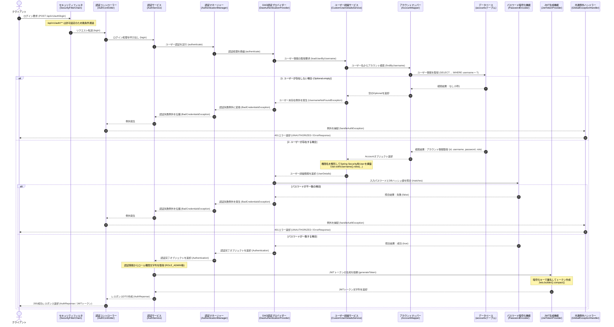

# 認証・認可API仕様書

---

## 1. 概要

---

### 1.1 目的

本APIは認証・認可に必要なトークン取得機能を提供します。

### 1.2 システム構成

- **技術スタック**:
  - Spring Security, MyBatis, JWT (`jjwt`), PostgreSQL, BCrypt
- **方式**:
  - JWT（JSON Web Token）によるステートレス認証
- **パスワードハッシュ化**:
  - BCrypt（アルゴリズム）

## 2. JWT トークン仕様

---

- **ヘッダー/形式**:
  - Bearer トークン (`Authorization: Bearer <token>`)
- **有効期限**:
  - 24時間 (`86,400,000` ms)
- **Claims（トークンに含まれる情報）**:
  - `sub` (username)
  - `roles` (権限情報)
  - `iat` / `exp` (発行日時・有効期限)

## 3. API仕様

---

### 3.1 エンドポイント一覧

| エンドポイント | HTTPメソッド | 必要な権限 | 概要 |
| --- | --- | --- | --- |
| `/api/v1/auth/login` | POST | 未認証（PermitAll） | 認証実行・JWT発行 |
| `/v3/api-docs/**` | GET | 未認証（PermitAll） | Swagger API定義 |
| `/swagger-ui/**` | GET | 未認証（PermitAll） | Swagger UI |
| `/api/v1/sales/**` など | ALL | 要認証 (`authenticated`) | 営業系業務API |

### 3.2 認証実行・JWT発行

- **エンドポイント**: `POST /api/v1/auth/login`
- **Content-Type**: `application/json`

#### リクエストパラメータ

| パラメータ | 型 | 必須 | 説明 |
| --- | --- | --- | --- |
| `username` | string | 〇 | ユーザー名 |
| `password` | string | 〇 | パスワード |

#### リクエストボディ

```json
  {
    "username": "admin",
    "password": "password123"
  }
```

#### 成功レスポンス（成功・201 OK）

```json
  {
    "token": [トークンの内容]
  }
```

#### エラーレスポンス

##### 認証エラー（401・UNAUTHORIZED）

```json
{
  "error": "UNAUTHORIZED",
  "message": "ユーザー名またはパスワードが正しくありません。",
  "status": 401,
  "timestamp": "2026-07-31T01:24:18.956275700Z"
}
```

##### その他エラー（500・INTERNAL SERVER ERROR）

```json
{
  "error": "INTERNAL_SERVER_ERROR",
  "message": "システムエラーが発生しました。時間をおいて再度お試しください。",
  "status": 500,
  "timestamp": "2026-07-31T01:24:18.956275700Z"
}
```

---

## 4. 処理フロー（シーケンス図）

### 4.1 ログイン認証・JWTトークン発行処理シーケンス



### 4.2 アプリケーション起動時の初期データ投入フロー（参考）

```mermaid
sequenceDiagram
    autonumber
    participant App as システム起動処理<br/>(SalesApplication)
    participant AuthCtrl as 認証コントローラー<br/>(AuthController / initDatabase)
    participant Mapper as アカウントマッパー<br/>(AccountMapper)
    participant DB as データベース<br/>(accountsテーブル)
    participant Encoder as パスワード暗号化機能<br/>(PasswordEncoder)

    App->>AuthCtrl: 起動時初期化処理を実行 (CommandLineRunner)
    AuthCtrl->>Mapper: 「admin」ユーザーの存在確認 (findByUsername)
    Mapper->>DB: accountsテーブルから「admin」を検索 (SELECT)
    
    alt admin ユーザーが存在しない場合
        DB-->>Mapper: 検索結果：なし (0件)
        Mapper-->>AuthCtrl: 未登録 (Optional.empty) を返却
        AuthCtrl->>Encoder: 初期パスワード「password123」を暗号化 (encode)
        Encoder-->>AuthCtrl: ハッシュ化された文字列を返却
        AuthCtrl->>Mapper: 管理者アカウント (admin) の登録要求 (insert)
        Mapper->>DB: accountsテーブルへ新規登録 (INSERT)
    else admin ユーザーが既に存在する場合
        DB-->>Mapper: 検索結果：あり (1件)
        Mapper-->>AuthCtrl: 登録済みアカウント情報を返却
        Note over AuthCtrl: データ登録処理をスキップ
    end
   ```
